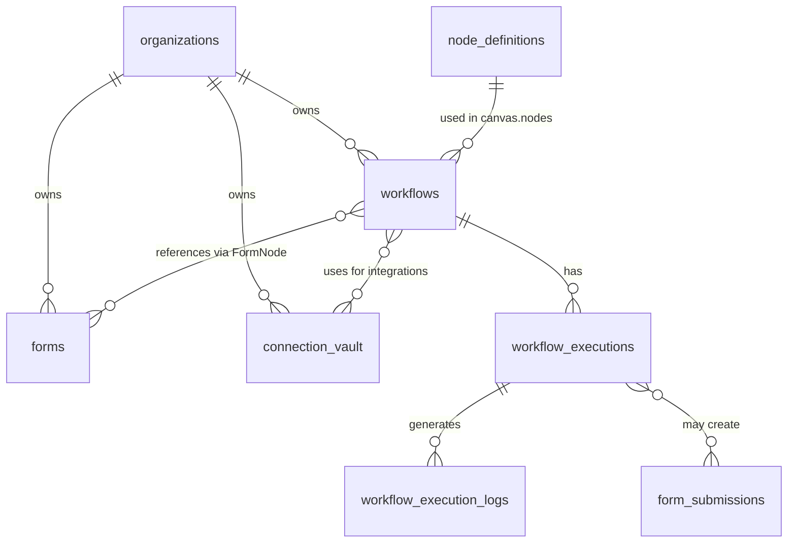
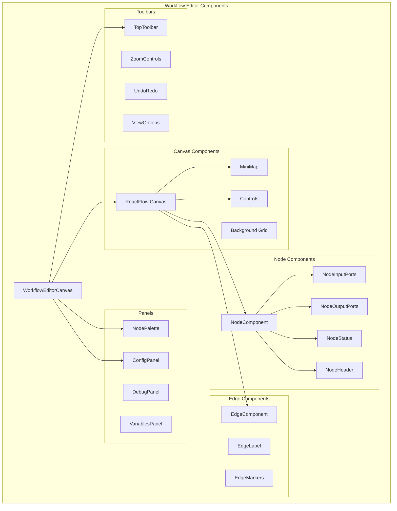
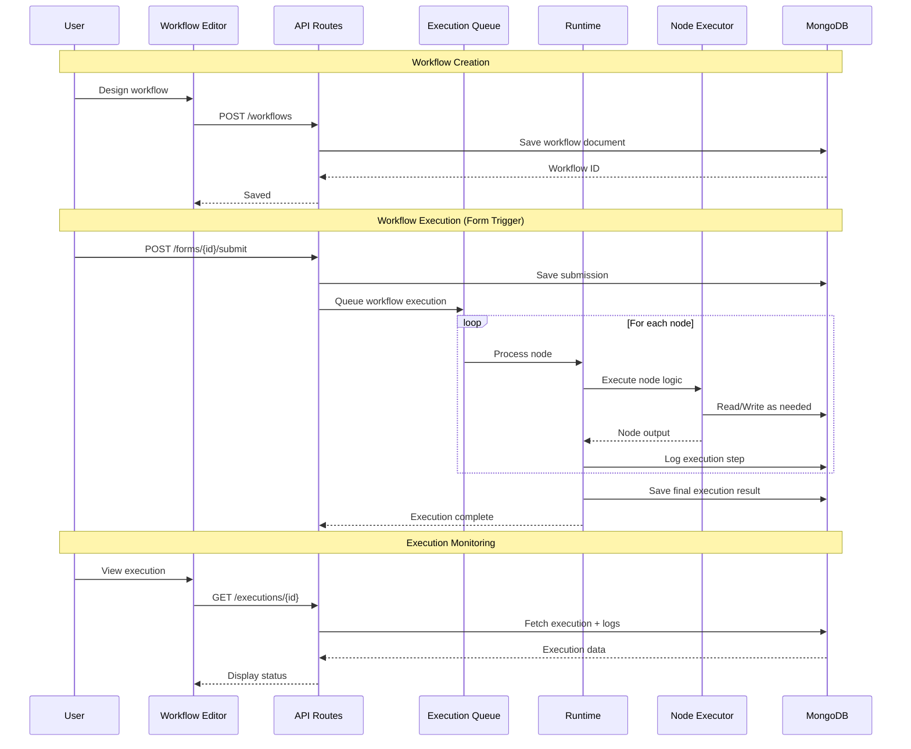
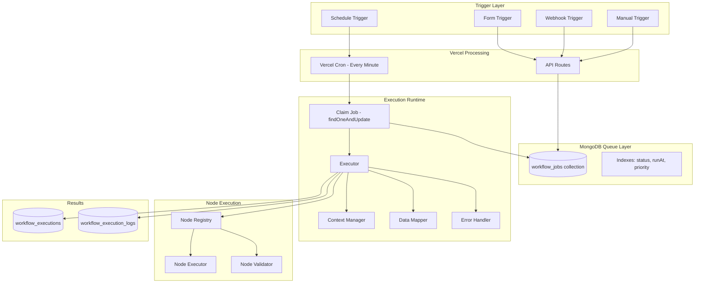
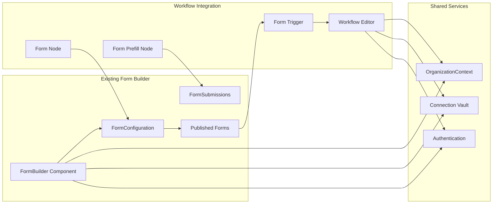

# Workflow Orchestration Platform Design

## Executive Summary

This document outlines the architecture for extending the existing Form Builder application into a visual workflow orchestration platform. Forms become one node type among many in a drag-and-drop workflow editor, enabling complex automation pipelines.

---

## 1. Database Schema Design

### MongoDB Collections Overview

```
Platform Database (form_builder_platform)
├── workflows              # Workflow definitions
├── workflow_versions      # Version history
├── workflow_jobs          # Job queue for async execution (MongoDB-based queue)
├── workflow_executions    # Execution records
├── workflow_execution_logs # Detailed step logs
├── node_definitions       # Custom node type registry
└── workflow_templates     # Pre-built workflow templates

Organization Database (org_[orgId])
├── org_workflows          # Org-specific workflows
├── org_workflow_secrets   # Encrypted credentials for integrations
├── org_node_configs       # Saved node configurations
└── existing collections...
```

### Collection Schemas

#### workflows

```typescript
interface WorkflowDocument {
  _id: ObjectId;

  // Identity
  id: string;                    // UUID for external reference
  orgId: string;                 // Organization owner
  name: string;
  description?: string;
  slug: string;                  // URL-safe identifier

  // Visual Editor State
  canvas: {
    nodes: WorkflowNode[];       // Node instances
    edges: WorkflowEdge[];       // Connections between nodes
    viewport: {
      x: number;
      y: number;
      zoom: number;
    };
  };

  // Workflow Configuration
  settings: {
    executionMode: 'sequential' | 'parallel' | 'auto';
    maxExecutionTime: number;    // ms, default 5 minutes
    retryPolicy: {
      maxRetries: number;
      backoffMultiplier: number;
      initialDelayMs: number;
    };
    errorHandling: 'stop' | 'continue' | 'rollback';
    timezone: string;            // For scheduled triggers
  };

  // Variables & Context
  variables: WorkflowVariable[];
  inputSchema?: JSONSchema;      // Expected input structure
  outputSchema?: JSONSchema;     // Guaranteed output structure

  // State
  status: 'draft' | 'active' | 'paused' | 'archived';
  version: number;
  publishedVersion?: number;

  // Metadata
  tags: string[];
  createdAt: Date;
  updatedAt: Date;
  createdBy: string;
  lastModifiedBy: string;

  // Analytics
  stats: {
    totalExecutions: number;
    successfulExecutions: number;
    failedExecutions: number;
    avgExecutionTimeMs: number;
    lastExecutedAt?: Date;
  };
}

interface WorkflowNode {
  id: string;                    // Unique within workflow
  type: string;                  // Node type identifier

  // Position on canvas
  position: { x: number; y: number };

  // Node-specific configuration
  config: Record<string, any>;   // Validated against node schema

  // Display
  label?: string;                // Custom label override
  notes?: string;                // User notes
  collapsed?: boolean;

  // Execution behavior
  enabled: boolean;
  timeout?: number;              // Override workflow default
  retryPolicy?: RetryPolicy;     // Override workflow default

  // Conditional execution
  runCondition?: {
    expression: string;          // JavaScript expression
    skipOnFalse: boolean;        // Skip vs fail
  };
}

interface WorkflowEdge {
  id: string;
  source: string;                // Source node ID
  sourceHandle: string;          // Output port ID
  target: string;                // Target node ID
  targetHandle: string;          // Input port ID

  // Data transformation
  mapping?: DataMapping[];       // Output→Input field mappings

  // Conditional routing
  condition?: {
    expression: string;
    label?: string;              // Display label for condition
  };

  // Visual
  animated?: boolean;
  style?: EdgeStyle;
}

interface DataMapping {
  sourceField: string;           // JSONPath to source value
  targetField: string;           // JSONPath to target location
  transform?: string;            // Optional transformation expression
}
```

#### workflow_executions

```typescript
interface WorkflowExecution {
  _id: ObjectId;

  // References
  workflowId: string;
  workflowVersion: number;
  orgId: string;

  // Trigger info
  trigger: {
    type: 'manual' | 'schedule' | 'webhook' | 'form_submission' | 'api';
    nodeId?: string;             // Trigger node that started execution
    payload?: Record<string, any>;
    source?: {
      ip?: string;
      userAgent?: string;
      userId?: string;
    };
  };

  // Execution state
  status: 'pending' | 'running' | 'paused' | 'completed' | 'failed' | 'cancelled';
  startedAt: Date;
  completedAt?: Date;

  // Progress tracking
  currentNodeId?: string;
  completedNodes: string[];
  failedNodes: string[];
  skippedNodes: string[];

  // Data flow
  context: {
    variables: Record<string, any>;     // Workflow variables
    nodeOutputs: Record<string, any>;   // Output by node ID
    errors: ExecutionError[];
  };

  // Final result
  result?: {
    success: boolean;
    output?: Record<string, any>;
    error?: ExecutionError;
  };

  // Performance
  metrics: {
    totalDurationMs: number;
    nodeMetrics: Record<string, {
      durationMs: number;
      retries: number;
      dataSize: number;
    }>;
  };
}

interface ExecutionError {
  nodeId: string;
  code: string;
  message: string;
  details?: Record<string, any>;
  timestamp: Date;
  stack?: string;
}
```

#### workflow_execution_logs

```typescript
interface ExecutionLog {
  _id: ObjectId;
  executionId: string;
  nodeId: string;

  timestamp: Date;
  level: 'debug' | 'info' | 'warn' | 'error';

  event: 'node_start' | 'node_complete' | 'node_error' | 'node_skip' |
         'data_transform' | 'condition_eval' | 'retry' | 'custom';

  message: string;
  data?: Record<string, any>;    // Input/output snapshots (configurable)

  // TTL index for auto-cleanup
  expiresAt: Date;
}
```

#### node_definitions (Custom Node Registry)

```typescript
interface NodeDefinition {
  _id: ObjectId;

  // Identity
  type: string;                  // Unique type identifier
  version: string;               // Semver

  // Display
  name: string;
  description: string;
  icon: string;                  // Icon name or URL
  color: string;                 // Theme color
  category: NodeCategory;
  tags: string[];

  // Schema
  configSchema: JSONSchema;      // Configuration UI schema
  inputPorts: PortDefinition[];
  outputPorts: PortDefinition[];

  // Execution
  executorType: 'builtin' | 'javascript' | 'http' | 'mongodb';
  executor: {
    // For builtin: handler name
    // For javascript: code string
    // For http: endpoint config
    // For mongodb: aggregation pipeline template
    handler: string;
    timeout?: number;
  };

  // Metadata
  isBuiltin: boolean;
  orgId?: string;                // null for global/builtin
  createdAt: Date;
  updatedAt: Date;
}

type NodeCategory =
  | 'triggers'
  | 'logic'
  | 'data'
  | 'integrations'
  | 'actions'
  | 'ai'
  | 'forms'
  | 'custom';
```

### MongoDB Indexes

```javascript
// workflows collection
db.workflows.createIndex({ "orgId": 1, "status": 1 });
db.workflows.createIndex({ "orgId": 1, "slug": 1 }, { unique: true });
db.workflows.createIndex({ "tags": 1 });
db.workflows.createIndex({ "updatedAt": -1 });

// workflow_executions collection
db.workflow_executions.createIndex({ "workflowId": 1, "startedAt": -1 });
db.workflow_executions.createIndex({ "orgId": 1, "status": 1 });
db.workflow_executions.createIndex({ "status": 1, "startedAt": 1 }); // For cleanup
db.workflow_executions.createIndex({ "completedAt": 1 }, { expireAfterSeconds: 2592000 }); // 30-day TTL

// workflow_execution_logs collection
db.workflow_execution_logs.createIndex({ "executionId": 1, "timestamp": 1 });
db.workflow_execution_logs.createIndex({ "expiresAt": 1 }, { expireAfterSeconds: 0 }); // TTL

// node_definitions collection
db.node_definitions.createIndex({ "type": 1, "version": 1 }, { unique: true });
db.node_definitions.createIndex({ "category": 1 });
db.node_definitions.createIndex({ "orgId": 1 }); // null for global
```

### Relationship to Existing Collections



---

## 2. Node Schema Specification

### Universal Node Interface

```typescript
// ============================================
// CORE NODE INTERFACES
// ============================================

/**
 * Port definition - defines an input or output connection point
 */
interface PortDefinition {
  id: string;                    // Unique within node
  label: string;                 // Display name
  type: PortDataType;            // Data type for validation
  required: boolean;             // Must be connected
  multiple: boolean;             // Accepts multiple connections
  defaultValue?: any;            // Default if not connected
  description?: string;

  // For complex types
  schema?: JSONSchema;           // Detailed structure
}

type PortDataType =
  | 'any'
  | 'string'
  | 'number'
  | 'boolean'
  | 'object'
  | 'array'
  | 'date'
  | 'file'
  | 'form_data'                  // Special: form submission structure
  | 'document'                   // MongoDB document
  | 'documents';                 // Array of documents

/**
 * Node lifecycle stage - determines position in workflow
 */
type NodeLifecycleStage =
  | 'trigger'                    // Starts workflow execution
  | 'processor'                  // Transforms data
  | 'action'                     // Side effects (send email, API call)
  | 'output';                    // Terminal node, produces final result

/**
 * Base node definition that all node types extend
 */
interface BaseNodeDefinition {
  // Identity
  type: string;                  // Unique identifier (e.g., 'form-trigger')
  version: string;               // Semver for backwards compatibility

  // Display
  name: string;                  // Human-readable name
  description: string;           // What this node does
  icon: string;                  // Material icon name or custom
  color: string;                 // Hex color for visual identification
  category: NodeCategory;

  // Lifecycle
  stage: NodeLifecycleStage;

  // Ports
  inputs: PortDefinition[];
  outputs: PortDefinition[];

  // Configuration schema (JSON Schema)
  configSchema: JSONSchema;

  // Dependencies
  dependencies: {
    requiredConnections?: string[];  // Vault IDs or service names
    requiredNodes?: string[];        // Prerequisite node types
    requiredFeatures?: string[];     // Feature flags
  };

  // Execution
  executor: NodeExecutor;

  // Error handling defaults
  errorHandling: {
    retryable: boolean;
    maxRetries: number;
    retryDelayMs: number;
    fallbackValue?: any;
  };

  // Documentation
  docs?: {
    examples: NodeExample[];
    tips: string[];
    warnings: string[];
  };
}

interface NodeExecutor {
  type: 'sync' | 'async' | 'streaming';
  timeout: number;               // Default timeout in ms

  // The actual execution function signature
  // (context: ExecutionContext) => Promise<NodeOutput>
}

interface NodeExample {
  title: string;
  description: string;
  config: Record<string, any>;
  sampleInput?: Record<string, any>;
  sampleOutput?: Record<string, any>;
}

// ============================================
// EXECUTION CONTEXT
// ============================================

interface ExecutionContext {
  // Workflow info
  workflowId: string;
  executionId: string;
  nodeId: string;

  // Input data from connected nodes
  inputs: Record<string, any>;   // Port ID → value

  // Node configuration
  config: Record<string, any>;

  // Workflow variables
  variables: Record<string, any>;

  // Previous node outputs (for expressions)
  nodeOutputs: Record<string, Record<string, any>>;

  // Services
  services: {
    mongodb: MongoDBService;     // For database operations
    http: HttpService;           // For external API calls
    vault: VaultService;         // For secrets/connections
    storage: StorageService;     // For file operations
    logger: LoggerService;       // For execution logging
  };

  // Utilities
  utils: {
    evaluate: (expression: string) => any;  // Expression evaluator
    transform: (data: any, mapping: DataMapping[]) => any;
  };
}

interface NodeOutput {
  success: boolean;
  data: Record<string, any>;     // Port ID → output value
  error?: {
    code: string;
    message: string;
    retryable: boolean;
  };
  metadata?: {
    durationMs: number;
    bytesProcessed?: number;
  };
}
```

### Example Node Definitions

#### Form Trigger Node

```typescript
const FormTriggerNode: BaseNodeDefinition = {
  type: 'form-trigger',
  version: '1.0.0',

  name: 'Form Submission',
  description: 'Triggers workflow when a form is submitted',
  icon: 'description',
  color: '#4CAF50',
  category: 'triggers',
  stage: 'trigger',

  inputs: [],  // Triggers have no inputs

  outputs: [
    {
      id: 'submission',
      label: 'Form Data',
      type: 'form_data',
      required: true,
      multiple: false,
      description: 'The submitted form data',
      schema: {
        type: 'object',
        properties: {
          _id: { type: 'string' },
          formId: { type: 'string' },
          data: { type: 'object' },  // Dynamic based on form fields
          metadata: {
            type: 'object',
            properties: {
              submittedAt: { type: 'string', format: 'date-time' },
              ip: { type: 'string' },
              userAgent: { type: 'string' }
            }
          }
        }
      }
    },
    {
      id: 'formConfig',
      label: 'Form Configuration',
      type: 'object',
      required: true,
      multiple: false,
      description: 'The form definition'
    }
  ],

  configSchema: {
    type: 'object',
    required: ['formId'],
    properties: {
      formId: {
        type: 'string',
        title: 'Form',
        description: 'Select a published form to trigger this workflow',
        'x-component': 'FormSelector'  // Custom UI component
      },
      filterCondition: {
        type: 'string',
        title: 'Filter Condition',
        description: 'Optional: Only trigger when this condition is true',
        'x-component': 'ExpressionEditor'
      },
      includeMetadata: {
        type: 'boolean',
        title: 'Include Metadata',
        description: 'Include submission metadata (IP, timestamp, etc.)',
        default: true
      }
    }
  },

  dependencies: {
    requiredConnections: [],
    requiredNodes: [],
    requiredFeatures: ['workflows']
  },

  executor: {
    type: 'async',
    timeout: 5000
  },

  errorHandling: {
    retryable: false,  // Triggers don't retry
    maxRetries: 0,
    retryDelayMs: 0
  },

  docs: {
    examples: [
      {
        title: 'Basic Form Trigger',
        description: 'Trigger workflow on any submission to the Contact Form',
        config: {
          formId: 'contact-form-123',
          includeMetadata: true
        },
        sampleOutput: {
          submission: {
            _id: 'sub_abc123',
            formId: 'contact-form-123',
            data: {
              name: 'John Doe',
              email: 'john@example.com',
              message: 'Hello!'
            },
            metadata: {
              submittedAt: '2024-01-15T10:30:00Z',
              ip: '192.168.1.1'
            }
          }
        }
      }
    ],
    tips: [
      'The form must be published for the trigger to work',
      'Use filter conditions to only process certain submissions'
    ],
    warnings: [
      'High-volume forms may cause many workflow executions'
    ]
  }
};
```

#### HTTP Request Node

```typescript
const HttpRequestNode: BaseNodeDefinition = {
  type: 'http-request',
  version: '1.0.0',

  name: 'HTTP Request',
  description: 'Make HTTP requests to external APIs',
  icon: 'http',
  color: '#FF9800',
  category: 'integrations',
  stage: 'action',

  inputs: [
    {
      id: 'trigger',
      label: 'Trigger',
      type: 'any',
      required: true,
      multiple: false,
      description: 'Triggers the HTTP request'
    },
    {
      id: 'body',
      label: 'Request Body',
      type: 'object',
      required: false,
      multiple: false,
      description: 'Optional request body (for POST/PUT/PATCH)'
    },
    {
      id: 'headers',
      label: 'Dynamic Headers',
      type: 'object',
      required: false,
      multiple: false,
      description: 'Additional headers to merge with config'
    }
  ],

  outputs: [
    {
      id: 'response',
      label: 'Response',
      type: 'object',
      required: true,
      multiple: false,
      schema: {
        type: 'object',
        properties: {
          status: { type: 'number' },
          statusText: { type: 'string' },
          headers: { type: 'object' },
          data: { type: 'any' }
        }
      }
    },
    {
      id: 'error',
      label: 'Error',
      type: 'object',
      required: false,
      multiple: false,
      description: 'Error output (alternative path on failure)'
    }
  ],

  configSchema: {
    type: 'object',
    required: ['url', 'method'],
    properties: {
      url: {
        type: 'string',
        title: 'URL',
        description: 'The endpoint URL (supports expressions like {{data.id}})',
        format: 'uri',
        'x-component': 'ExpressionInput'
      },
      method: {
        type: 'string',
        title: 'Method',
        enum: ['GET', 'POST', 'PUT', 'PATCH', 'DELETE', 'HEAD', 'OPTIONS'],
        default: 'GET'
      },
      headers: {
        type: 'object',
        title: 'Headers',
        description: 'Static request headers',
        additionalProperties: { type: 'string' },
        'x-component': 'KeyValueEditor'
      },
      authentication: {
        type: 'object',
        title: 'Authentication',
        properties: {
          type: {
            type: 'string',
            enum: ['none', 'basic', 'bearer', 'api-key', 'oauth2'],
            default: 'none'
          },
          credentials: {
            type: 'string',
            description: 'Vault ID for stored credentials',
            'x-component': 'VaultSelector'
          }
        }
      },
      body: {
        type: 'object',
        title: 'Static Body',
        description: 'Static request body (merged with dynamic input)',
        'x-component': 'JsonEditor'
      },
      timeout: {
        type: 'number',
        title: 'Timeout (ms)',
        default: 30000,
        minimum: 1000,
        maximum: 300000
      },
      followRedirects: {
        type: 'boolean',
        title: 'Follow Redirects',
        default: true
      },
      validateStatus: {
        type: 'string',
        title: 'Success Status Codes',
        description: 'Regex pattern for successful status codes',
        default: '^2\\d{2}$'
      }
    }
  },

  dependencies: {
    requiredConnections: [],
    requiredNodes: [],
    requiredFeatures: ['workflows', 'http_requests']
  },

  executor: {
    type: 'async',
    timeout: 30000
  },

  errorHandling: {
    retryable: true,
    maxRetries: 3,
    retryDelayMs: 1000,
    fallbackValue: null
  },

  docs: {
    examples: [
      {
        title: 'POST to webhook',
        description: 'Send form data to an external webhook',
        config: {
          url: 'https://api.example.com/webhooks/new-submission',
          method: 'POST',
          headers: { 'Content-Type': 'application/json' }
        },
        sampleInput: {
          body: { name: 'John', email: 'john@example.com' }
        },
        sampleOutput: {
          response: {
            status: 200,
            data: { success: true, id: 'webhook_123' }
          }
        }
      }
    ],
    tips: [
      'Use vault credentials for sensitive API keys',
      'Set appropriate timeouts for slow APIs'
    ],
    warnings: [
      'External API calls may fail - configure retry policy',
      'Be mindful of rate limits on external APIs'
    ]
  }
};
```

#### Conditional (If/Else) Node

```typescript
const ConditionalNode: BaseNodeDefinition = {
  type: 'conditional',
  version: '1.0.0',

  name: 'If/Else',
  description: 'Route workflow based on conditions',
  icon: 'call_split',
  color: '#9C27B0',
  category: 'logic',
  stage: 'processor',

  inputs: [
    {
      id: 'data',
      label: 'Input Data',
      type: 'any',
      required: true,
      multiple: false,
      description: 'Data to evaluate conditions against'
    }
  ],

  outputs: [
    {
      id: 'true',
      label: 'True',
      type: 'any',
      required: false,
      multiple: false,
      description: 'Output when condition is true'
    },
    {
      id: 'false',
      label: 'False',
      type: 'any',
      required: false,
      multiple: false,
      description: 'Output when condition is false'
    }
  ],

  configSchema: {
    type: 'object',
    required: ['conditions'],
    properties: {
      mode: {
        type: 'string',
        title: 'Evaluation Mode',
        enum: ['all', 'any'],
        default: 'all',
        description: 'All conditions must match, or any condition'
      },
      conditions: {
        type: 'array',
        title: 'Conditions',
        items: {
          type: 'object',
          properties: {
            field: {
              type: 'string',
              title: 'Field',
              'x-component': 'FieldPathSelector'
            },
            operator: {
              type: 'string',
              title: 'Operator',
              enum: [
                'equals', 'not_equals',
                'contains', 'not_contains',
                'starts_with', 'ends_with',
                'greater_than', 'less_than',
                'greater_or_equal', 'less_or_equal',
                'is_empty', 'is_not_empty',
                'is_true', 'is_false',
                'matches_regex'
              ]
            },
            value: {
              type: 'any',
              title: 'Value',
              'x-component': 'DynamicValueInput'
            }
          }
        },
        'x-component': 'ConditionBuilder'
      },
      passThrough: {
        type: 'boolean',
        title: 'Pass Through Data',
        description: 'Pass input data to output unchanged',
        default: true
      }
    }
  },

  dependencies: {
    requiredConnections: [],
    requiredNodes: [],
    requiredFeatures: []
  },

  executor: {
    type: 'sync',
    timeout: 1000
  },

  errorHandling: {
    retryable: false,
    maxRetries: 0,
    retryDelayMs: 0
  },

  docs: {
    examples: [
      {
        title: 'Route by form field',
        description: 'Different handling for different inquiry types',
        config: {
          mode: 'all',
          conditions: [
            {
              field: 'data.inquiryType',
              operator: 'equals',
              value: 'support'
            }
          ]
        }
      }
    ],
    tips: [
      'Use "any" mode for OR logic',
      'Combine with Switch node for multiple branches'
    ],
    warnings: []
  }
};
```

#### Email Action Node

```typescript
const EmailNode: BaseNodeDefinition = {
  type: 'email-send',
  version: '1.0.0',

  name: 'Send Email',
  description: 'Send emails via SMTP or email service provider',
  icon: 'email',
  color: '#2196F3',
  category: 'actions',
  stage: 'action',

  inputs: [
    {
      id: 'trigger',
      label: 'Trigger',
      type: 'any',
      required: true,
      multiple: false,
      description: 'Triggers email send'
    },
    {
      id: 'dynamicData',
      label: 'Template Data',
      type: 'object',
      required: false,
      multiple: false,
      description: 'Data for template interpolation'
    }
  ],

  outputs: [
    {
      id: 'result',
      label: 'Result',
      type: 'object',
      required: true,
      multiple: false,
      schema: {
        type: 'object',
        properties: {
          messageId: { type: 'string' },
          accepted: { type: 'array', items: { type: 'string' } },
          rejected: { type: 'array', items: { type: 'string' } }
        }
      }
    },
    {
      id: 'error',
      label: 'Error',
      type: 'object',
      required: false,
      multiple: false
    }
  ],

  configSchema: {
    type: 'object',
    required: ['to', 'subject'],
    properties: {
      provider: {
        type: 'string',
        title: 'Email Provider',
        enum: ['smtp', 'sendgrid', 'ses', 'postmark', 'resend'],
        default: 'smtp',
        'x-component': 'ProviderSelector'
      },
      credentials: {
        type: 'string',
        title: 'Credentials',
        description: 'Vault ID for email credentials',
        'x-component': 'VaultSelector'
      },
      from: {
        type: 'string',
        title: 'From',
        description: 'Sender email address',
        format: 'email'
      },
      to: {
        type: 'string',
        title: 'To',
        description: 'Recipient(s) - comma separated or expression',
        'x-component': 'ExpressionInput'
      },
      cc: {
        type: 'string',
        title: 'CC',
        'x-component': 'ExpressionInput'
      },
      bcc: {
        type: 'string',
        title: 'BCC',
        'x-component': 'ExpressionInput'
      },
      replyTo: {
        type: 'string',
        title: 'Reply To',
        format: 'email'
      },
      subject: {
        type: 'string',
        title: 'Subject',
        description: 'Email subject (supports template syntax)',
        'x-component': 'ExpressionInput'
      },
      contentType: {
        type: 'string',
        title: 'Content Type',
        enum: ['text', 'html', 'template'],
        default: 'html'
      },
      body: {
        type: 'string',
        title: 'Email Body',
        description: 'Email content with {{variable}} support',
        'x-component': 'RichTextEditor'
      },
      templateId: {
        type: 'string',
        title: 'Template ID',
        description: 'Provider template ID (if using template mode)'
      },
      attachments: {
        type: 'array',
        title: 'Attachments',
        items: {
          type: 'object',
          properties: {
            filename: { type: 'string' },
            content: { type: 'string' },
            encoding: { type: 'string', enum: ['base64', 'utf8'] }
          }
        }
      }
    }
  },

  dependencies: {
    requiredConnections: ['email_credentials'],
    requiredNodes: [],
    requiredFeatures: ['workflows', 'email_actions']
  },

  executor: {
    type: 'async',
    timeout: 30000
  },

  errorHandling: {
    retryable: true,
    maxRetries: 3,
    retryDelayMs: 5000
  },

  docs: {
    examples: [
      {
        title: 'Form submission notification',
        description: 'Send email when form is submitted',
        config: {
          provider: 'smtp',
          to: '{{formData.email}}',
          subject: 'Thank you for your submission, {{formData.name}}!',
          contentType: 'html',
          body: '<h1>Thank you!</h1><p>We received your message.</p>'
        }
      }
    ],
    tips: [
      'Use template variables for personalization',
      'Test with a single recipient before bulk sends'
    ],
    warnings: [
      'Check spam compliance before sending marketing emails',
      'Rate limits may apply based on provider'
    ]
  }
};
```

### Complete Node Type Registry

```typescript
// All built-in node types
const BUILTIN_NODE_TYPES = {
  // Triggers
  'form-trigger': FormTriggerNode,
  'webhook-trigger': WebhookTriggerNode,
  'schedule-trigger': ScheduleTriggerNode,
  'manual-trigger': ManualTriggerNode,
  'api-trigger': ApiTriggerNode,

  // Logic
  'conditional': ConditionalNode,
  'switch': SwitchNode,
  'loop': LoopNode,
  'delay': DelayNode,
  'merge': MergeNode,

  // Data
  'transform': TransformNode,
  'filter': FilterNode,
  'aggregate': AggregateNode,
  'split': SplitNode,
  'set-variable': SetVariableNode,

  // Integrations
  'http-request': HttpRequestNode,
  'mongodb-query': MongoDBQueryNode,
  'mongodb-write': MongoDBWriteNode,

  // Actions
  'email-send': EmailNode,
  'notification': NotificationNode,
  'file-write': FileWriteNode,

  // AI
  'ai-prompt': AiPromptNode,
  'ai-classify': AiClassifyNode,
  'ai-extract': AiExtractNode,

  // Forms (special)
  'form-prefill': FormPrefillNode,
  'form-update': FormUpdateNode,
} as const;

type BuiltinNodeType = keyof typeof BUILTIN_NODE_TYPES;
```

---

## 3. Architecture Diagram

### System Architecture Overview

```mermaid
graph TB
    subgraph "Frontend (Next.js)"
        WE[Workflow Editor]
        NP[Node Palette]
        CP[Config Panel]
        EM[Execution Monitor]
        FM[Form Builder]

        WE --> NP
        WE --> CP
        WE --> EM
    end

    subgraph "State Management"
        WC[WorkflowContext]
        OC[OrganizationContext]
        AC[AuthContext]

        WE --> WC
        WC --> OC
    end

    subgraph "API Layer (Next.js API Routes)"
        WA[/api/workflows/*]
        EA[/api/executions/*]
        NA[/api/nodes/*]
        FA[/api/forms/*]

        WE --> WA
        EM --> EA
        NP --> NA
        FM --> FA
    end

    subgraph "Execution Engine"
        EQ[Execution Queue]
        WK[Workers]
        RT[Runtime]

        EA --> EQ
        EQ --> WK
        WK --> RT
    end

    subgraph "Node Executors"
        FE[Form Executor]
        HE[HTTP Executor]
        ME[MongoDB Executor]
        AE[AI Executor]
        CE[Custom Executor]

        RT --> FE
        RT --> HE
        RT --> ME
        RT --> AE
        RT --> CE
    end

    subgraph "Data Layer (MongoDB)"
        PDB[(Platform DB)]
        ODB[(Org Databases)]
        TDB[(Target DBs)]

        WA --> PDB
        WA --> ODB
        FE --> PDB
        ME --> TDB
    end

    subgraph "External Services"
        EM_SVC[Email Services]
        AI_SVC[AI APIs]
        WH[Webhooks]

        HE --> WH
        AE --> AI_SVC
    end
```

### Component Breakdown



### Data Flow Architecture



### Execution Engine Architecture



### Integration Points with Form Builder



---

## 4. Implementation Phases

### Phase Overview

| Phase | Focus | Complexity | Duration Estimate |
|-------|-------|------------|-------------------|
| 1 | Foundation & Basic Editor | M | Foundation |
| 2 | Core Node Types | L | Core Feature |
| 3 | Execution Engine | XL | Critical Path |
| 4 | Form Integration | M | Key Feature |
| 5 | Advanced Features | L | Enhancement |
| 6 | Polish & Scale | M | Production Ready |

### Phase 1: Foundation & Basic Editor

**Objective**: Establish workflow data models and basic visual editor

**Deliverables**:
- [ ] MongoDB collections for workflows, executions, node definitions
- [ ] Basic WorkflowContext for state management
- [ ] React Flow integration with custom theme
- [ ] Node palette with placeholder nodes
- [ ] Basic canvas operations (add, remove, connect nodes)
- [ ] Workflow CRUD API routes
- [ ] Simple workflow save/load functionality

**Technical Tasks**:
```
1. Database Setup
   ├── Create workflow collections
   ├── Define indexes
   └── Create migration scripts

2. Type Definitions
   ├── WorkflowDocument interface
   ├── WorkflowNode interface
   ├── WorkflowEdge interface
   └── Execution interfaces

3. Frontend Setup
   ├── Install @xyflow/react
   ├── Create WorkflowContext
   ├── Build WorkflowEditorCanvas
   ├── Create base NodeComponent
   └── Build EdgeComponent

4. API Routes
   ├── POST /api/workflows
   ├── GET /api/workflows
   ├── GET /api/workflows/[id]
   ├── PATCH /api/workflows/[id]
   └── DELETE /api/workflows/[id]
```

**Dependencies**: None (starting point)

**Complexity**: M (Medium)
- React Flow has good documentation
- Builds on existing patterns from form builder

---

### Phase 2: Core Node Types

**Objective**: Implement essential node types for basic workflows

**Deliverables**:
- [ ] Node definition registry system
- [ ] Node configuration panel with dynamic forms
- [ ] Manual Trigger node
- [ ] Transform node (data manipulation)
- [ ] Conditional node (if/else routing)
- [ ] HTTP Request node
- [ ] Data mapping interface between nodes

**Technical Tasks**:
```
1. Node Registry
   ├── BaseNodeDefinition implementation
   ├── Node type registration system
   ├── Config schema validation (ajv)
   └── Node executor interface

2. Configuration Panel
   ├── Dynamic form renderer from JSON Schema
   ├── Expression input component
   ├── JSON editor component
   └── Port connection visualizer

3. Node Implementations
   ├── ManualTriggerNode
   ├── TransformNode
   ├── ConditionalNode
   ├── HttpRequestNode
   └── Unit tests for each

4. Data Mapping
   ├── DataMapping interface
   ├── JSONPath selector component
   ├── Transform expression evaluator
   └── Type compatibility checking
```

**Dependencies**: Phase 1 complete

**Complexity**: L (Large)
- Many node types to implement
- Configuration UI is complex
- Expression evaluation needs careful design

---

### Phase 3: Execution Engine

**Objective**: Build reliable workflow execution system

**Deliverables**:
- [ ] MongoDB-based job queue setup
- [ ] Vercel cron job for queue processing
- [ ] Workflow validation service
- [ ] Execution runtime with node traversal
- [ ] Execution logging system
- [ ] Error handling and retry logic
- [ ] Execution status API
- [ ] Polling-based execution monitoring UI

**Technical Tasks**:
```
1. Queue Infrastructure (MongoDB-based)
   ├── WorkflowJob collection and indexes
   ├── MongoWorkflowQueue class implementation
   ├── Vercel cron endpoint for processing
   └── Job priority and retry logic

2. Execution Runtime
   ├── WorkflowValidator class
   ├── ExecutionContext implementation
   ├── Graph traversal algorithm
   ├── Parallel branch handling
   └── Variable/context management

3. Node Execution
   ├── NodeExecutor base class
   ├── Timeout handling
   ├── Retry logic implementation
   ├── Error classification
   └── Output validation

4. Monitoring
   ├── ExecutionLog collection
   ├── Polling-based status updates (Vercel-compatible)
   ├── Execution history UI
   └── Debug/trace mode

5. API Routes
   ├── POST /api/executions (manual trigger)
   ├── GET /api/executions/[id]
   ├── GET /api/executions/[id]/logs
   ├── POST /api/executions/[id]/cancel
   └── POST /api/executions/[id]/retry
```

**Dependencies**: Phase 1 & 2 complete

**Complexity**: XL (Extra Large)
- Most critical and complex phase
- Requires careful error handling
- Performance and reliability critical

---

### Phase 4: Form Integration

**Objective**: Connect workflows with existing form builder

**Deliverables**:
- [ ] Form Trigger node (workflow starts on form submit)
- [ ] Form Prefill node (populate form from workflow data)
- [ ] Form selector in node configuration
- [ ] Published forms appear in node palette
- [ ] Form field → output port mapping
- [ ] Submission data schema inference

**Technical Tasks**:
```
1. Form Trigger Node
   ├── FormTriggerNode implementation
   ├── Form submission webhook integration
   ├── Form field to output port mapping
   └── Filter condition support

2. Form Integration
   ├── Form selector component
   ├── Field schema extraction
   ├── Dynamic port generation from form fields
   └── Form preview in node config

3. Form Prefill Node
   ├── FormPrefillNode implementation
   ├── Input port → form field mapping
   ├── URL parameter generation
   └── Pre-populated form link output

4. UI Integration
   ├── "Forms" category in node palette
   ├── Published forms as available triggers
   ├── Form builder → workflow link
   └── Workflow → form builder link

5. Submission Pipeline
   ├── Modify form submit API to check for workflows
   ├── Queue workflow execution on submit
   └── Submission metadata in execution context
```

**Dependencies**: Phase 3 complete

**Complexity**: M (Medium)
- Leverages existing form infrastructure
- Well-defined integration points
- Mostly connection/plumbing work

---

### Phase 5: Advanced Features

**Objective**: Add power-user features and additional node types

**Deliverables**:
- [ ] Schedule trigger (cron-based)
- [ ] Webhook trigger
- [ ] MongoDB Query/Write nodes
- [ ] Email action node
- [ ] AI nodes (prompt, classify, extract)
- [ ] Loop node
- [ ] Workflow variables UI
- [ ] Workflow templates

**Technical Tasks**:
```
1. Trigger Nodes
   ├── ScheduleTriggerNode (cron)
   ├── WebhookTriggerNode
   ├── Webhook URL generation
   └── Cron scheduler integration

2. Integration Nodes
   ├── MongoDBQueryNode
   ├── MongoDBWriteNode
   ├── Vault integration for connections
   └── Query builder UI

3. Action Nodes
   ├── EmailNode (multi-provider)
   ├── NotificationNode
   └── Template variable system

4. AI Nodes
   ├── AiPromptNode
   ├── AiClassifyNode
   ├── AiExtractNode
   └── AI provider abstraction

5. Logic Nodes
   ├── LoopNode (forEach, while)
   ├── SwitchNode (multi-branch)
   ├── MergeNode (join branches)
   └── DelayNode

6. Templates
   ├── Template collection
   ├── Template CRUD API
   ├── Template browser UI
   └── "Use template" flow
```

**Dependencies**: Phase 4 complete

**Complexity**: L (Large)
- Many features but individually straightforward
- Can be parallelized across team members

---

### Phase 6: Polish & Production Readiness

**Objective**: Production-ready with performance and UX polish

**Deliverables**:
- [ ] Undo/redo support
- [ ] Keyboard shortcuts
- [ ] Performance optimization (large workflows)
- [ ] Error boundary improvements
- [ ] Comprehensive testing
- [ ] Documentation
- [ ] Usage analytics
- [ ] Rate limiting for executions

**Technical Tasks**:
```
1. Editor Polish
   ├── Undo/redo with useReducer history
   ├── Keyboard shortcuts (Ctrl+Z, Delete, etc.)
   ├── Copy/paste nodes
   ├── Node grouping/comments
   └── Improved validation feedback

2. Performance
   ├── Virtual rendering for large workflows
   ├── Lazy loading node configs
   ├── Execution log pagination
   └── Database query optimization

3. Testing
   ├── Unit tests for all nodes
   ├── Integration tests for execution
   ├── E2E tests for editor
   └── Load testing for queue

4. Production
   ├── Rate limiting per org
   ├── Usage metering
   ├── Audit logging
   ├── Backup/restore workflows
   └── Import/export functionality

5. Documentation
   ├── User documentation
   ├── Node reference docs
   ├── API documentation
   └── Example workflows
```

**Dependencies**: Phase 5 complete

**Complexity**: M (Medium)
- Polish work, no major new features
- Testing can run in parallel with features

---

### MVP Definition

**Minimum Viable Product (Phases 1-3 + partial Phase 4)**:

```
MVP Feature Set:
├── Visual workflow editor with drag-drop
├── Core nodes: Manual Trigger, Transform, Conditional, HTTP Request
├── Form Trigger node (start workflow on form submit)
├── Basic execution engine with status tracking
├── Execution history and logs
├── Integration with existing form builder
└── Error handling with retries

MVP Excludes:
├── Schedule triggers
├── AI nodes
├── Email actions
├── Workflow templates
├── Real-time collaboration
└── Advanced monitoring/analytics
```

---

## 5. Technology Recommendations

### Canvas/Diagram Library

| Option | Pros | Cons | Recommendation |
|--------|------|------|----------------|
| **@xyflow/react (React Flow)** | Mature, well-documented, large community, TypeScript, customizable | Paid for some features (pro) | **Recommended** |
| **xyflow** | Same as above, newer branding | Same as above | Same library, use @xyflow/react |
| **React Diagrams** | Full-featured | Heavier, more complex API | Consider for complex needs |
| **Custom Canvas** | Full control | Significant dev time | Only if unique requirements |

**Recommendation: @xyflow/react**

```typescript
// Example setup
import ReactFlow, {
  Background,
  Controls,
  MiniMap,
  useNodesState,
  useEdgesState,
  addEdge,
} from '@xyflow/react';

const WorkflowEditor = () => {
  const [nodes, setNodes, onNodesChange] = useNodesState(initialNodes);
  const [edges, setEdges, onEdgesChange] = useEdgesState(initialEdges);

  return (
    <ReactFlow
      nodes={nodes}
      edges={edges}
      onNodesChange={onNodesChange}
      onEdgesChange={onEdgesChange}
      nodeTypes={customNodeTypes}
      edgeTypes={customEdgeTypes}
      fitView
    >
      <Background />
      <Controls />
      <MiniMap />
    </ReactFlow>
  );
};
```

### Execution Engine Pattern

| Pattern | Pros | Cons | Recommendation |
|---------|------|------|----------------|
| **MongoDB-based Queue** | Uses existing MongoDB, no new infra, Vercel-compatible | Requires polling or Change Streams | **Recommended** |
| **Vercel Cron + MongoDB** | Serverless-native, simple | Limited to 1-min intervals | Good for schedules |
| **Direct execution** | Simplest, immediate | Blocks request, timeout limits | Simple workflows |
| **Inngest/Trigger.dev** | Managed service, reliable | External dependency, cost | Consider for scale |

**Recommendation: MongoDB-based Queue with Vercel-compatible Patterns**

Since we're deploying on Vercel and want to keep everything MongoDB-based, we'll use a custom queue implementation backed by MongoDB. This works well with Vercel's serverless model.

```typescript
// MongoDB Job Queue Collection Schema
interface WorkflowJob {
  _id: ObjectId;
  workflowId: string;
  executionId: string;
  orgId: string;

  status: 'pending' | 'processing' | 'completed' | 'failed';
  priority: number;

  // Execution data
  trigger: WorkflowTrigger;

  // Scheduling
  runAt: Date;                    // When to run (for delayed jobs)
  lockedAt?: Date;                // When a worker picked it up
  lockedBy?: string;              // Worker ID for distributed locking

  // Retry handling
  attempts: number;
  maxAttempts: number;
  lastError?: string;
  nextRetryAt?: Date;

  // Timestamps
  createdAt: Date;
  completedAt?: Date;

  // TTL for cleanup
  expiresAt: Date;
}

// MongoDB indexes for efficient queue operations
db.workflow_jobs.createIndex({ "status": 1, "runAt": 1, "priority": -1 });
db.workflow_jobs.createIndex({ "lockedAt": 1 }, { expireAfterSeconds: 300 }); // Auto-unlock stale
db.workflow_jobs.createIndex({ "orgId": 1, "status": 1 });
db.workflow_jobs.createIndex({ "expiresAt": 1 }, { expireAfterSeconds: 0 }); // TTL cleanup
```

**Queue Implementation (Vercel-compatible)**

```typescript
// src/lib/workflow/queue/mongoQueue.ts

export class MongoWorkflowQueue {
  private collection: Collection<WorkflowJob>;

  constructor(db: Db) {
    this.collection = db.collection('workflow_jobs');
  }

  // Add job to queue
  async enqueue(job: Omit<WorkflowJob, '_id' | 'status' | 'createdAt'>): Promise<string> {
    const result = await this.collection.insertOne({
      ...job,
      status: 'pending',
      attempts: 0,
      maxAttempts: job.maxAttempts || 3,
      createdAt: new Date(),
      expiresAt: new Date(Date.now() + 7 * 24 * 60 * 60 * 1000), // 7 days
    });
    return result.insertedId.toString();
  }

  // Claim next available job (with distributed locking)
  async claimJob(workerId: string): Promise<WorkflowJob | null> {
    const now = new Date();
    const staleThreshold = new Date(now.getTime() - 5 * 60 * 1000); // 5 min

    const job = await this.collection.findOneAndUpdate(
      {
        status: { $in: ['pending', 'processing'] },
        runAt: { $lte: now },
        $or: [
          { lockedAt: null },
          { lockedAt: { $lt: staleThreshold } }, // Reclaim stale jobs
        ],
      },
      {
        $set: {
          status: 'processing',
          lockedAt: now,
          lockedBy: workerId,
        },
        $inc: { attempts: 1 },
      },
      {
        sort: { priority: -1, runAt: 1 },
        returnDocument: 'after',
      }
    );

    return job;
  }

  // Mark job complete
  async complete(jobId: ObjectId, result?: any): Promise<void> {
    await this.collection.updateOne(
      { _id: jobId },
      {
        $set: {
          status: 'completed',
          completedAt: new Date(),
          result,
        },
        $unset: { lockedAt: 1, lockedBy: 1 },
      }
    );
  }

  // Mark job failed (with retry logic)
  async fail(jobId: ObjectId, error: string, retryable: boolean = true): Promise<void> {
    const job = await this.collection.findOne({ _id: jobId });
    if (!job) return;

    const shouldRetry = retryable && job.attempts < job.maxAttempts;
    const backoffMs = Math.pow(2, job.attempts) * 1000; // Exponential backoff

    await this.collection.updateOne(
      { _id: jobId },
      {
        $set: {
          status: shouldRetry ? 'pending' : 'failed',
          lastError: error,
          ...(shouldRetry && {
            runAt: new Date(Date.now() + backoffMs),
            lockedAt: null,
            lockedBy: null,
          }),
        },
      }
    );
  }
}
```

**Vercel Cron for Queue Processing**

```typescript
// src/app/api/cron/process-workflows/route.ts
// Vercel cron: runs every minute

import { NextResponse } from 'next/server';

export const runtime = 'nodejs';
export const maxDuration = 60; // Max 60 seconds on Vercel

export async function GET(req: Request) {
  // Verify cron secret
  const authHeader = req.headers.get('authorization');
  if (authHeader !== `Bearer ${process.env.CRON_SECRET}`) {
    return NextResponse.json({ error: 'Unauthorized' }, { status: 401 });
  }

  const queue = new MongoWorkflowQueue(db);
  const runtime = new WorkflowRuntime();
  const workerId = `vercel-${Date.now()}`;

  let processed = 0;
  const startTime = Date.now();
  const maxRuntime = 55000; // Leave 5s buffer

  // Process jobs until timeout
  while (Date.now() - startTime < maxRuntime) {
    const job = await queue.claimJob(workerId);
    if (!job) break; // No more jobs

    try {
      await runtime.execute(job.workflowId, job.executionId, job.trigger);
      await queue.complete(job._id);
      processed++;
    } catch (error) {
      await queue.fail(job._id, error.message, error.retryable !== false);
    }
  }

  return NextResponse.json({ processed, duration: Date.now() - startTime });
}
```

**vercel.json cron configuration**

```json
{
  "crons": [
    {
      "path": "/api/cron/process-workflows",
      "schedule": "* * * * *"
    }
  ]
}
```

**Alternative: Immediate Execution for Simple Workflows**

For workflows that complete quickly, execute immediately in the API route:

```typescript
// src/app/api/forms/[formId]/submit/route.ts

export async function POST(req: Request) {
  // ... form submission logic ...

  // Check for linked workflows
  const workflows = await getWorkflowsForForm(formId);

  for (const workflow of workflows) {
    if (workflow.settings.executionMode === 'immediate') {
      // Execute synchronously for simple workflows
      await executeWorkflowSync(workflow, submission);
    } else {
      // Queue for background processing
      await queue.enqueue({
        workflowId: workflow.id,
        executionId: generateExecutionId(),
        orgId: workflow.orgId,
        trigger: { type: 'form_submission', payload: submission },
        priority: 1,
        runAt: new Date(),
      });
    }
  }
}
```

### State Management

**Recommendation: Zustand + React Context**

```typescript
// WorkflowStore with Zustand
import { create } from 'zustand';
import { temporal } from 'zundo';

interface WorkflowState {
  workflow: WorkflowDocument | null;
  selectedNodeId: string | null;
  isDirty: boolean;

  // Actions
  setWorkflow: (workflow: WorkflowDocument) => void;
  addNode: (node: WorkflowNode) => void;
  updateNode: (nodeId: string, updates: Partial<WorkflowNode>) => void;
  removeNode: (nodeId: string) => void;
  addEdge: (edge: WorkflowEdge) => void;
  removeEdge: (edgeId: string) => void;
  selectNode: (nodeId: string | null) => void;
}

export const useWorkflowStore = create<WorkflowState>()(
  temporal(
    (set, get) => ({
      workflow: null,
      selectedNodeId: null,
      isDirty: false,

      setWorkflow: (workflow) => set({ workflow, isDirty: false }),

      addNode: (node) => set((state) => ({
        workflow: state.workflow ? {
          ...state.workflow,
          canvas: {
            ...state.workflow.canvas,
            nodes: [...state.workflow.canvas.nodes, node],
          },
        } : null,
        isDirty: true,
      })),

      // ... other actions
    }),
    { limit: 50 } // Undo history limit
  )
);
```

### Form Builder Integration

**Recommendation: Shared Context + Event System**

```typescript
// Shared form context
interface FormWorkflowIntegration {
  // Get forms available for workflow triggers
  getPublishedForms: () => Promise<FormConfiguration[]>;

  // Get form field schema for port mapping
  getFormFieldSchema: (formId: string) => Promise<JSONSchema>;

  // Register workflow trigger on form
  registerFormTrigger: (formId: string, workflowId: string) => Promise<void>;

  // Trigger workflow from form submission
  onFormSubmission: (formId: string, submission: FormSubmission) => void;
}
```

### Additional Libraries

| Purpose | Library | Notes |
|---------|---------|-------|
| JSON Schema forms | `@rjsf/core` + `@rjsf/mui` | For node config panels |
| Expression evaluation | `expr-eval` or custom | For data transformations |
| JSONPath | `jsonpath-plus` | For data mapping |
| Cron parsing | `cron-parser` | For schedule triggers (Vercel cron) |
| Email | `nodemailer` or `resend` | Multi-provider support |
| Validation | `ajv` | JSON Schema validation |
| Date handling | `dayjs` | Lightweight, timezone support |
| Unique IDs | `nanoid` | Fast, URL-safe unique IDs |

**Vercel-specific considerations:**
- All libraries should work in serverless (no persistent connections required)
- Prefer stateless patterns over in-memory caching
- Use MongoDB for any state that needs to persist between function invocations

---

## 6. Key Technical Decisions

### Decision 1: Execution Model

**Question**: How should workflow execution be handled?

| Option | Description | Pros | Cons |
|--------|-------------|------|------|
| **A: Synchronous in API** | Execute workflow directly in API route | Simple, immediate feedback | Blocks request, timeouts, no scale |
| **B: Background Queue** | Queue execution, process async | Scalable, reliable, retry support | Complexity, delay before results |
| **C: Hybrid** | Simple workflows sync, complex async | Best of both | Logic complexity |

**Recommendation**: **Option B (Background Queue)**

Workflows are inherently long-running. Even "simple" workflows may include HTTP calls with unpredictable latency. Queue-based execution provides:
- Reliability (retries, dead letter queues)
- Scalability (horizontal worker scaling)
- Observability (execution history)
- User experience (non-blocking UI)

---

### Decision 2: Data Typing Strategy

**Question**: How strictly should we type data between nodes?

| Option | Description | Pros | Cons |
|--------|-------------|------|------|
| **A: Loose typing (any)** | Accept any data, runtime errors | Flexible, easy to implement | Hard to debug, no IDE support |
| **B: Strict typing** | Full TypeScript types, compile-time checks | Safe, good DX | Complex, less flexible |
| **C: Runtime validation** | JSON Schema validation at execution | Balanced, clear errors | Performance cost |

**Recommendation**: **Option C (Runtime Validation)**

Use JSON Schema for port definitions. Validate data at runtime when flowing between nodes. This provides:
- Clear error messages ("Node X expected object, got string")
- Schema-driven UI for data mapping
- Flexibility for dynamic data structures
- Documentation via schemas

---

### Decision 3: Expression Language

**Question**: What language for data transformations and conditions?

| Option | Description | Pros | Cons |
|--------|-------------|------|------|
| **A: JavaScript subset** | Allow JS expressions with sandbox | Powerful, familiar | Security concerns |
| **B: Custom DSL** | Build domain-specific language | Safe, tailored | Learning curve, dev time |
| **C: JSONPath + templates** | Path queries + Handlebars-style | Simple, proven | Limited power |
| **D: JSONata** | JSON query/transform language | Powerful, designed for JSON | Learning curve |

**Recommendation**: **Option D (JSONata)** or **Option C (JSONPath + templates)**

For MVP, start with **Option C** (simpler):
- JSONPath for data access: `$.submission.data.email`
- Template syntax for strings: `Hello {{name}}!`
- Simple operators for conditions: `value > 10`

Evolve to **Option D** (JSONata) for power users:
```jsonata
/* Sum all order totals where status is 'complete' */
$sum(orders[status='complete'].total)
```

---

### Decision 4: Node Versioning

**Question**: How to handle node definition updates?

| Option | Description | Pros | Cons |
|--------|-------------|------|------|
| **A: Always latest** | Workflows use current node version | Simple, no version tracking | Breaking changes break workflows |
| **B: Version pinning** | Workflows pin to specific version | Stable, predictable | Version management complexity |
| **C: Migration system** | Auto-migrate on version bump | Best of both | Complex to implement |

**Analysis - Why This Decision Matters:**

When you update a node definition (e.g., adding a new required config field to the HTTP Request node), what happens to existing workflows that use the old config structure?

- **Option A (Always Latest)**: Existing workflows immediately use new node code. If the config schema changed, workflows may break silently or throw errors.

- **Option B (Version Pinning)**: Each workflow records which version of each node type it uses (e.g., `"http-request@1.2.0"`). Old workflows keep working with old behavior. Users opt-in to updates.

- **Option C (Auto-Migration)**: System automatically transforms old configs to new format. Requires writing migration scripts for every change.

**Recommendation for MVP**: **Option A (Always Latest)** with careful backwards compatibility

For the initial implementation, keeping it simple:

```typescript
// Node definitions include backwards-compatible config handling
const HttpRequestNode: NodeDefinition = {
  type: 'http-request',
  version: '1.0.0',

  // Config schema with sensible defaults for new fields
  configSchema: {
    type: 'object',
    properties: {
      url: { type: 'string' },
      method: { type: 'string', default: 'GET' },
      // New field added in v1.1 - has default so old configs still work
      followRedirects: { type: 'boolean', default: true },
    },
  },

  // Executor handles missing/old config gracefully
  async execute(context: ExecutionContext) {
    const config = {
      followRedirects: true, // Default for old workflows
      ...context.config,     // Override with actual config
    };
    // ...
  },
};
```

**Guidelines for backwards compatibility:**
1. New config fields MUST have defaults
2. Never remove required fields (deprecate instead)
3. Never change the meaning of existing fields
4. Document breaking changes clearly

**Future Enhancement (Phase 6+)**: Implement full version pinning when:
- Node ecosystem grows significantly
- Third-party/custom nodes are supported
- Enterprise customers need strict version control

```typescript
// Future: Version-pinned workflow
interface WorkflowNode {
  id: string;
  type: 'http-request';
  version: '1.2.0';  // Pinned version
  config: { ... };
}

// Registry maintains multiple versions
const nodeRegistry = {
  'http-request@1.0.0': HttpRequestNodeV1,
  'http-request@1.1.0': HttpRequestNodeV1_1,
  'http-request@1.2.0': HttpRequestNodeV1_2,
};
```

---

### Decision 5: Real-time Updates

**Question**: How to show execution progress in real-time?

| Option | Description | Pros | Cons |
|--------|-------------|------|------|
| **A: Polling** | Client polls for status | Simple, stateless, Vercel-friendly | Latency, server load |
| **B: Server-Sent Events** | Server pushes updates | Low latency | Limited on Vercel (timeout) |
| **C: MongoDB Change Streams** | Database-driven updates | Native MongoDB, reliable | Requires replica set |
| **D: Hybrid Polling** | Smart polling with exponential backoff | Balanced, serverless-friendly | Slightly more complex |

**Recommendation**: **Option D (Hybrid Polling)** for Vercel deployment

On Vercel's serverless platform, long-lived connections (SSE/WebSockets) have timeout limitations. A smart polling strategy works better:

```typescript
// src/hooks/useExecutionStatus.ts
// Smart polling with exponential backoff

import { useEffect, useState, useCallback } from 'react';

interface ExecutionStatus {
  status: 'pending' | 'running' | 'completed' | 'failed';
  currentNodeId?: string;
  completedNodes: string[];
  progress: number;
}

export function useExecutionStatus(executionId: string) {
  const [status, setStatus] = useState<ExecutionStatus | null>(null);
  const [error, setError] = useState<Error | null>(null);

  const poll = useCallback(async () => {
    try {
      const res = await fetch(`/api/executions/${executionId}`);
      const data = await res.json();
      setStatus(data);
      return data;
    } catch (err) {
      setError(err as Error);
      return null;
    }
  }, [executionId]);

  useEffect(() => {
    let timeoutId: NodeJS.Timeout;
    let pollInterval = 500; // Start fast
    const maxInterval = 5000; // Max 5 seconds
    const backoffMultiplier = 1.5;

    const pollWithBackoff = async () => {
      const data = await poll();

      if (data?.status === 'running' || data?.status === 'pending') {
        // Still running - continue polling with backoff
        pollInterval = Math.min(pollInterval * backoffMultiplier, maxInterval);
        timeoutId = setTimeout(pollWithBackoff, pollInterval);
      } else if (data?.status === 'completed' || data?.status === 'failed') {
        // Terminal state - stop polling
        return;
      }
    };

    pollWithBackoff();

    return () => {
      if (timeoutId) clearTimeout(timeoutId);
    };
  }, [executionId, poll]);

  return { status, error, refetch: poll };
}
```

**Alternative: MongoDB Change Streams (for self-hosted deployments)**

If deploying to a platform that supports long-lived connections, use Change Streams:

```typescript
// Only for non-Vercel deployments with persistent connections
export async function streamExecutionUpdates(executionId: string) {
  const pipeline = [
    { $match: { 'documentKey._id': new ObjectId(executionId) } }
  ];

  const changeStream = db.collection('workflow_executions').watch(pipeline);

  changeStream.on('change', (change) => {
    // Emit update to client
    broadcastUpdate(executionId, change.fullDocument);
  });

  return changeStream;
}
```

**Client-side Optimistic Updates**

For better UX, combine polling with optimistic UI updates:

```typescript
// When user triggers execution
const startExecution = async (workflowId: string) => {
  // Optimistically show "pending" immediately
  setStatus({ status: 'pending', progress: 0 });

  // Queue the execution
  const { executionId } = await fetch(`/api/workflows/${workflowId}/execute`, {
    method: 'POST',
  }).then(r => r.json());

  // Start polling for real updates
  startPolling(executionId);
};
```

---

### Decision 6: Error Recovery Strategy

**Question**: What happens when a node fails?

| Option | Description | When to Use |
|--------|-------------|-------------|
| **Stop execution** | Halt workflow, mark as failed | Critical errors, default |
| **Skip and continue** | Mark node failed, continue to next | Non-critical nodes |
| **Retry** | Retry node N times with backoff | Transient failures |
| **Fallback** | Use fallback value, continue | When default is acceptable |
| **Error branch** | Route to error handling nodes | Custom error handling |

**Recommendation**: **Configurable per-node with workflow defaults**

```typescript
interface ErrorHandlingConfig {
  strategy: 'stop' | 'skip' | 'retry' | 'fallback' | 'error_branch';
  retryConfig?: {
    maxRetries: number;
    backoffMs: number;
    backoffMultiplier: number;
  };
  fallbackValue?: any;
  errorBranchNodeId?: string;
}
```

---

### Decision 7: Multi-tenancy Isolation

**Question**: How to isolate workflow executions between organizations?

**Recommendation**: **Organization-scoped queries with shared MongoDB collection**

Since we're using MongoDB for the job queue, we can achieve org isolation through query filtering rather than separate queues:

```typescript
// src/lib/workflow/queue/orgScopedQueue.ts

export class OrgScopedWorkflowQueue {
  private collection: Collection<WorkflowJob>;

  constructor(db: Db) {
    this.collection = db.collection('workflow_jobs');
  }

  // Enqueue job for specific org
  async enqueue(orgId: string, job: WorkflowJobInput): Promise<string> {
    const result = await this.collection.insertOne({
      ...job,
      orgId,
      status: 'pending',
      attempts: 0,
      createdAt: new Date(),
      expiresAt: new Date(Date.now() + 7 * 24 * 60 * 60 * 1000),
    });
    return result.insertedId.toString();
  }

  // Claim job - processes all orgs but respects org priority/limits
  async claimJob(workerId: string): Promise<WorkflowJob | null> {
    const now = new Date();
    const staleThreshold = new Date(now.getTime() - 5 * 60 * 1000);

    // Use findOneAndUpdate with org-aware sorting
    // Higher-tier orgs could get priority via the priority field
    const job = await this.collection.findOneAndUpdate(
      {
        status: { $in: ['pending', 'processing'] },
        runAt: { $lte: now },
        $or: [
          { lockedAt: null },
          { lockedAt: { $lt: staleThreshold } },
        ],
      },
      {
        $set: {
          status: 'processing',
          lockedAt: now,
          lockedBy: workerId,
        },
        $inc: { attempts: 1 },
      },
      {
        sort: { priority: -1, runAt: 1 },
        returnDocument: 'after',
      }
    );

    return job;
  }

  // Get jobs for specific org (for org admin dashboard)
  async getOrgJobs(orgId: string, status?: string): Promise<WorkflowJob[]> {
    const query: any = { orgId };
    if (status) query.status = status;

    return this.collection
      .find(query)
      .sort({ createdAt: -1 })
      .limit(100)
      .toArray();
  }

  // Count pending jobs per org (for rate limiting)
  async getPendingCount(orgId: string): Promise<number> {
    return this.collection.countDocuments({
      orgId,
      status: { $in: ['pending', 'processing'] },
    });
  }

  // Org-level rate limiting
  async canEnqueue(orgId: string, maxPending: number = 100): Promise<boolean> {
    const count = await this.getPendingCount(orgId);
    return count < maxPending;
  }
}

// Usage in cron job
export async function processWorkflowJobs() {
  const queue = new OrgScopedWorkflowQueue(db);
  const runtime = new WorkflowRuntime();
  const workerId = `worker-${Date.now()}`;

  const job = await queue.claimJob(workerId);
  if (!job) return;

  // Load org context for the job
  const orgContext = await loadOrgContext(job.orgId);

  try {
    // Execute with org-specific limits and credentials
    await runtime.execute(job, orgContext);
    await queue.complete(job._id);
  } catch (error) {
    await queue.fail(job._id, error.message);
  }
}
```

**Benefits of this approach:**
- Single collection = simpler operations and monitoring
- Org isolation via queries (indexed on `orgId`)
- Easy to implement per-org rate limits
- Per-org job visibility in admin dashboards
- Works perfectly with Vercel's stateless model

---

## 7. File Structure

Proposed file structure for the workflow extension:

```
src/
├── app/
│   ├── api/
│   │   ├── workflows/
│   │   │   ├── route.ts                    # GET (list), POST (create)
│   │   │   ├── [workflowId]/
│   │   │   │   ├── route.ts                # GET, PATCH, DELETE
│   │   │   │   ├── execute/route.ts        # POST (manual trigger)
│   │   │   │   ├── validate/route.ts       # POST (validation)
│   │   │   │   └── versions/route.ts       # GET versions
│   │   │   └── templates/route.ts          # GET templates
│   │   ├── executions/
│   │   │   ├── route.ts                    # GET (list by org)
│   │   │   ├── [executionId]/
│   │   │   │   ├── route.ts                # GET status
│   │   │   │   ├── logs/route.ts           # GET logs
│   │   │   │   ├── cancel/route.ts         # POST cancel
│   │   │   │   └── stream/route.ts         # GET SSE stream
│   │   └── nodes/
│   │       ├── route.ts                    # GET available nodes
│   │       └── [type]/route.ts             # GET node definition
│   └── workflows/
│       ├── page.tsx                        # Workflow list page
│       ├── [workflowId]/
│       │   ├── page.tsx                    # Workflow editor page
│       │   └── executions/page.tsx         # Execution history
│       └── new/page.tsx                    # New workflow page
├── components/
│   └── WorkflowEditor/
│       ├── WorkflowEditorCanvas.tsx        # Main canvas component
│       ├── WorkflowToolbar.tsx             # Top toolbar
│       ├── NodePalette/
│       │   ├── NodePalette.tsx             # Draggable node list
│       │   ├── NodeCategory.tsx            # Category accordion
│       │   └── NodePaletteItem.tsx         # Single draggable node
│       ├── ConfigPanel/
│       │   ├── ConfigPanel.tsx             # Right sidebar
│       │   ├── NodeConfigForm.tsx          # Dynamic config form
│       │   ├── PortMappingEditor.tsx       # Data mapping UI
│       │   └── ExpressionEditor.tsx        # Expression input
│       ├── Nodes/
│       │   ├── BaseNode.tsx                # Base node component
│       │   ├── NodePorts.tsx               # Input/output ports
│       │   ├── NodeStatus.tsx              # Execution status badge
│       │   ├── triggers/
│       │   │   ├── FormTriggerNode.tsx
│       │   │   ├── WebhookTriggerNode.tsx
│       │   │   └── ScheduleTriggerNode.tsx
│       │   ├── logic/
│       │   │   ├── ConditionalNode.tsx
│       │   │   ├── SwitchNode.tsx
│       │   │   └── LoopNode.tsx
│       │   ├── data/
│       │   │   ├── TransformNode.tsx
│       │   │   └── FilterNode.tsx
│       │   ├── actions/
│       │   │   ├── HttpRequestNode.tsx
│       │   │   └── EmailNode.tsx
│       │   └── index.ts                    # Node type registry
│       ├── Edges/
│       │   ├── DataEdge.tsx                # Custom edge component
│       │   └── ConditionalEdge.tsx         # Edge with condition
│       ├── Execution/
│       │   ├── ExecutionMonitor.tsx        # Real-time status
│       │   ├── ExecutionHistory.tsx        # Past executions list
│       │   ├── ExecutionDetail.tsx         # Single execution view
│       │   └── ExecutionLogs.tsx           # Log viewer
│       ├── Variables/
│       │   ├── VariablesPanel.tsx          # Workflow variables
│       │   └── VariableEditor.tsx          # Single variable
│       └── index.ts
├── contexts/
│   └── WorkflowContext.tsx                 # Workflow state context
├── hooks/
│   ├── useWorkflow.ts                      # Workflow operations
│   ├── useWorkflowExecution.ts             # Execution monitoring
│   └── useNodeConfig.ts                    # Node configuration
├── lib/
│   ├── workflow/
│   │   ├── engine/
│   │   │   ├── WorkflowRuntime.ts          # Execution runtime
│   │   │   ├── NodeExecutor.ts             # Base executor
│   │   │   ├── ExecutionContext.ts         # Context management
│   │   │   └── DataMapper.ts               # Data transformation
│   │   ├── nodes/
│   │   │   ├── registry.ts                 # Node type registry
│   │   │   ├── definitions/
│   │   │   │   ├── triggers.ts
│   │   │   │   ├── logic.ts
│   │   │   │   ├── data.ts
│   │   │   │   ├── actions.ts
│   │   │   │   └── forms.ts
│   │   │   └── executors/
│   │   │       ├── FormTriggerExecutor.ts
│   │   │       ├── HttpRequestExecutor.ts
│   │   │       ├── ConditionalExecutor.ts
│   │   │       └── EmailExecutor.ts
│   │   ├── validation/
│   │   │   ├── WorkflowValidator.ts        # Workflow validation
│   │   │   └── schemas.ts                  # JSON schemas
│   │   ├── queue/
│   │   │   ├── setup.ts                    # Queue configuration
│   │   │   ├── worker.ts                   # Worker process
│   │   │   └── jobs.ts                     # Job definitions
│   │   └── utils/
│   │       ├── expressions.ts              # Expression evaluation
│   │       ├── jsonpath.ts                 # JSONPath utilities
│   │       └── graph.ts                    # Graph algorithms
│   └── mongodb/
│       └── workflows.ts                    # Workflow DB operations
└── types/
    └── workflow.ts                         # All workflow types
```

---

## 8. Next Steps

1. **Review and approve this design document**
2. **Set up development branch** for workflow features
3. **Begin Phase 1** with database schema and basic editor
4. **Establish testing strategy** early (unit, integration, E2E)
5. **Create design mockups** for workflow editor UI

---

## Appendix A: Sample Workflow Document

```json
{
  "_id": "wf_abc123",
  "id": "wf_abc123",
  "orgId": "org_xyz789",
  "name": "New Contact Notification",
  "description": "Send notification when contact form is submitted",
  "slug": "new-contact-notification",

  "canvas": {
    "nodes": [
      {
        "id": "trigger_1",
        "type": "form-trigger",
        "position": { "x": 100, "y": 200 },
        "config": {
          "formId": "form_contact123",
          "includeMetadata": true
        },
        "enabled": true
      },
      {
        "id": "condition_1",
        "type": "conditional",
        "position": { "x": 350, "y": 200 },
        "config": {
          "mode": "all",
          "conditions": [
            {
              "field": "$.submission.data.inquiryType",
              "operator": "equals",
              "value": "sales"
            }
          ]
        },
        "enabled": true
      },
      {
        "id": "email_1",
        "type": "email-send",
        "position": { "x": 600, "y": 100 },
        "config": {
          "provider": "smtp",
          "credentials": "vault_email_creds",
          "to": "sales@example.com",
          "subject": "New Sales Inquiry from {{submission.data.name}}",
          "body": "<h1>New Lead</h1><p>{{submission.data.message}}</p>"
        },
        "enabled": true
      },
      {
        "id": "email_2",
        "type": "email-send",
        "position": { "x": 600, "y": 300 },
        "config": {
          "provider": "smtp",
          "credentials": "vault_email_creds",
          "to": "support@example.com",
          "subject": "New Support Request from {{submission.data.name}}",
          "body": "<h1>Support Request</h1><p>{{submission.data.message}}</p>"
        },
        "enabled": true
      }
    ],
    "edges": [
      {
        "id": "edge_1",
        "source": "trigger_1",
        "sourceHandle": "submission",
        "target": "condition_1",
        "targetHandle": "data"
      },
      {
        "id": "edge_2",
        "source": "condition_1",
        "sourceHandle": "true",
        "target": "email_1",
        "targetHandle": "trigger",
        "condition": { "label": "Sales" }
      },
      {
        "id": "edge_3",
        "source": "condition_1",
        "sourceHandle": "false",
        "target": "email_2",
        "targetHandle": "trigger",
        "condition": { "label": "Other" }
      }
    ],
    "viewport": { "x": 0, "y": 0, "zoom": 1 }
  },

  "settings": {
    "executionMode": "auto",
    "maxExecutionTime": 60000,
    "retryPolicy": {
      "maxRetries": 3,
      "backoffMultiplier": 2,
      "initialDelayMs": 1000
    },
    "errorHandling": "stop",
    "timezone": "America/New_York"
  },

  "variables": [],
  "status": "active",
  "version": 1,
  "publishedVersion": 1,
  "tags": ["notifications", "contact-form"],

  "createdAt": "2024-01-15T10:00:00Z",
  "updatedAt": "2024-01-15T10:30:00Z",
  "createdBy": "user_abc",
  "lastModifiedBy": "user_abc",

  "stats": {
    "totalExecutions": 150,
    "successfulExecutions": 148,
    "failedExecutions": 2,
    "avgExecutionTimeMs": 2500,
    "lastExecutedAt": "2024-01-16T14:30:00Z"
  }
}
```

---

## Appendix B: Execution Example

```json
{
  "_id": "exec_def456",
  "workflowId": "wf_abc123",
  "workflowVersion": 1,
  "orgId": "org_xyz789",

  "trigger": {
    "type": "form_submission",
    "nodeId": "trigger_1",
    "payload": {
      "formId": "form_contact123",
      "submissionId": "sub_ghi789",
      "data": {
        "name": "Jane Smith",
        "email": "jane@example.com",
        "inquiryType": "sales",
        "message": "Interested in enterprise plan"
      }
    }
  },

  "status": "completed",
  "startedAt": "2024-01-16T14:30:00Z",
  "completedAt": "2024-01-16T14:30:02Z",

  "currentNodeId": null,
  "completedNodes": ["trigger_1", "condition_1", "email_1"],
  "failedNodes": [],
  "skippedNodes": ["email_2"],

  "context": {
    "variables": {},
    "nodeOutputs": {
      "trigger_1": {
        "submission": {
          "_id": "sub_ghi789",
          "data": { "name": "Jane Smith", "inquiryType": "sales" }
        }
      },
      "condition_1": {
        "result": true,
        "data": { "name": "Jane Smith", "inquiryType": "sales" }
      },
      "email_1": {
        "result": {
          "messageId": "<abc123@smtp.example.com>",
          "accepted": ["sales@example.com"]
        }
      }
    },
    "errors": []
  },

  "result": {
    "success": true,
    "output": {
      "emailsSent": 1,
      "recipients": ["sales@example.com"]
    }
  },

  "metrics": {
    "totalDurationMs": 2100,
    "nodeMetrics": {
      "trigger_1": { "durationMs": 50, "retries": 0 },
      "condition_1": { "durationMs": 5, "retries": 0 },
      "email_1": { "durationMs": 2000, "retries": 0 }
    }
  }
}
```
